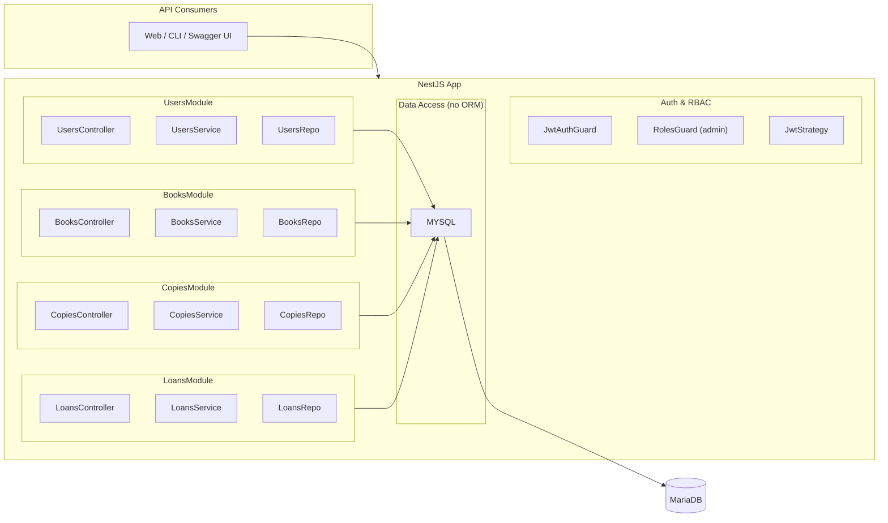
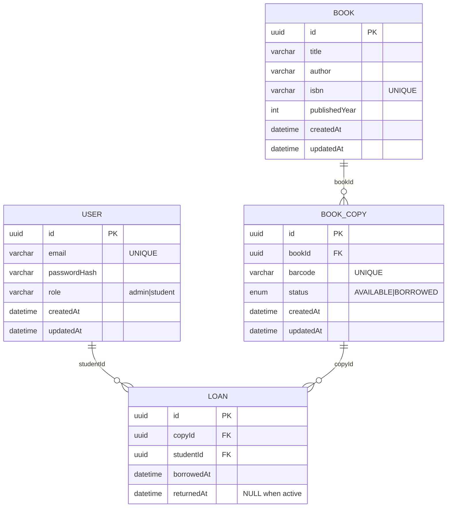
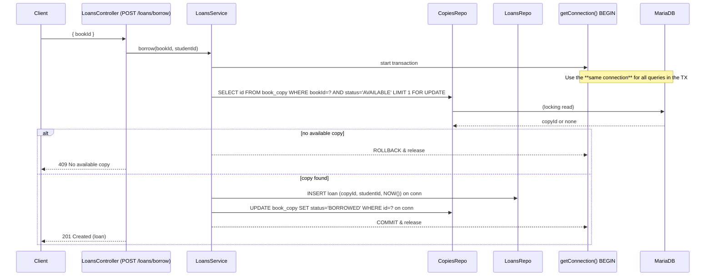
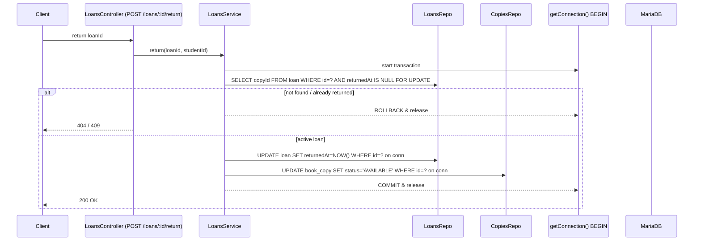

# Student Library API — System Design (Steps 5–7)

> Scope: **5) Books CRUD (+ Users CRUD for admin)** · **6) Copies management (admin)** · **7) Loans with transactions + guards (students)**.
> Stack: NestJS (controllers/services/guards) + JWT (Passport) + raw SQL via `mysql2/promise` + MariaDB (InnoDB).

---

## 1) High-level architecture (updated)



**Notes**
- Guards gate access: `JwtAuthGuard` authenticates; `RolesGuard` authorizes admin-only routes.
- Validation (added in 5.2): global `ValidationPipe` + DTOs ensure input correctness and stripping of unknown fields.

---

## 2) Domain model (tables & relationships)



**Integrity & concurrency**
- Borrow uses **transaction + row lock** so only one active loan can exist per copy at a time.
- (Optional DB safety net) Add a generated column `is_active = (returnedAt IS NULL)` and a `UNIQUE(copyId, is_active)` index, keeping app-level TX logic intact.

---

## 3) Core request flows

### 3.1 Borrow (student)



### 3.2 Return (student)



---

## 4) API surface (new/updated)

**Users (admin only)**  
- `GET /users`, `GET /users/:id`, `POST /users`, `PATCH /users/:id`, `DELETE /users/:id` → `JwtAuthGuard` + `RolesGuard('admin')`.

**Books**  
- Public: `GET /books`, `GET /books/:id`  
- Admin: `POST /books`, `PATCH /books/:id`, `DELETE /books/:id`  
- 5.2 (later): add DTOs + `ValidationPipe` globally.

**Copies (admin)**  
- `POST /books/:bookId/copies` `{ barcode }`  
- `GET /books/:bookId/copies`  
- `PATCH /copies/:id` (status or barcode)  
- (Optional) `DELETE /copies/:id`

**Loans (student)**  
- `POST /loans/borrow` `{ bookId }` (TX + row lock)  
- `POST /loans/:id/return` (TX)

---

## 5) Module & file layout

```
src/
  auth/
    ... (guards, strategy)
  users/
    users.controller.ts
    users.service.ts
    users.repo.ts
    dto/ (after 5.2)
  books/
    books.controller.ts
    books.service.ts
    books.repo.ts
    dto/
  copies/
    copies.controller.ts
    copies.service.ts
    copies.repo.ts
  loans/
    loans.controller.ts
    loans.service.ts
    loans.repo.ts
  database/
    mysql.module.ts   # mysql2/promise Pool provider
    migrate.ts        # SQL runner
```

**Division of responsibilities**
- **Controllers**: routing + I/O + guards
- **Services**: business rules + transaction boundaries
- **Repositories**: SQL only (no business logic)

---

## 6) Implementation notes

- **Transactions (mysql2/promise)**: use `pool.getConnection()`, `beginTransaction()`, run all queries on that connection, and `commit()` / `rollback()` then `release()`.
- **Locking read**: `SELECT ... FOR UPDATE` inside a TX to reserve a copy row; understand isolation to avoid deadlocks.
- **Validation (after first pass)**: `ValidationPipe({ whitelist: true, transform: true })` with DTOs.
- **Swagger**: add Bearer auth via `DocumentBuilder().addBearerAuth()` and `@ApiBearerAuth()`.
- **Security polish** (later): Helmet, Throttler (rate limit login), CORS, basic caching on public `GET /books*`.

---

## 7) References (paste into PR/README)

- NestJS: Guards; Validation & Pipes; Providers/DI; Custom providers; OpenAPI (Swagger) + Security; Rate limiting; Caching.
- mysql2: Quickstart; Promise wrapper.
- MySQL/InnoDB: Locking reads (SELECT ... FOR UPDATE); Isolation levels; Locks set by statements.
- MariaDB: SELECT FOR UPDATE; Generated Columns.
- MySQL UNIQUE indexes & NULL semantics (implications for one-active-loan constraint).
