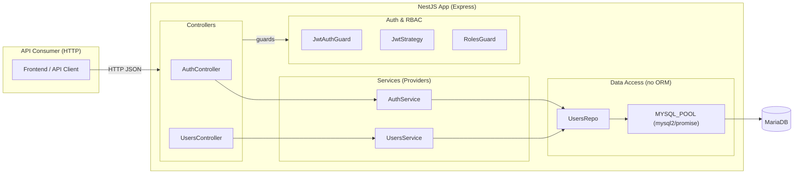
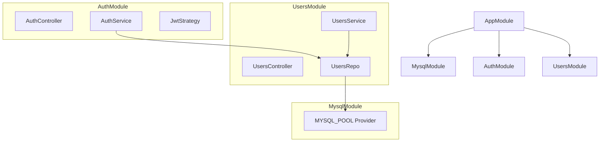
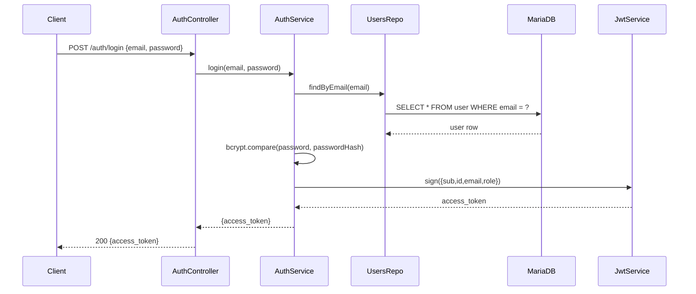
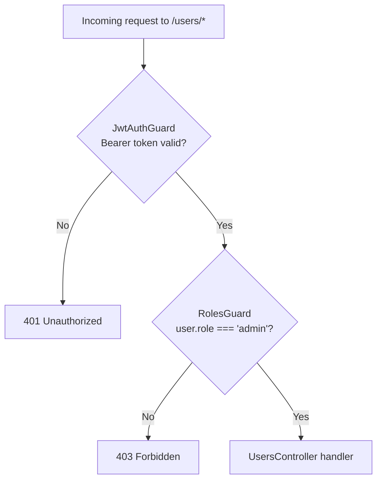
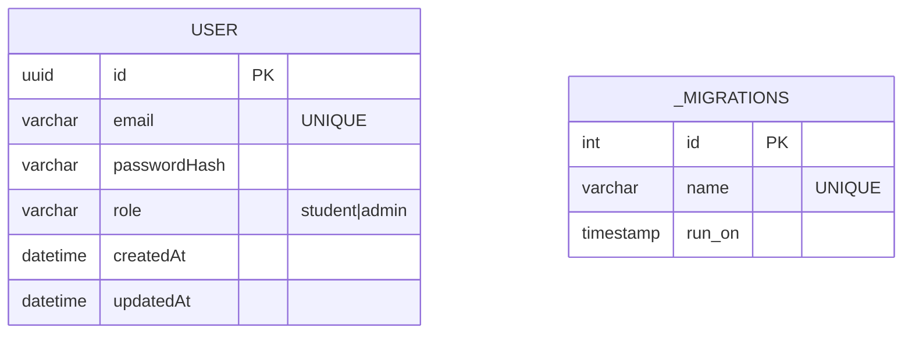
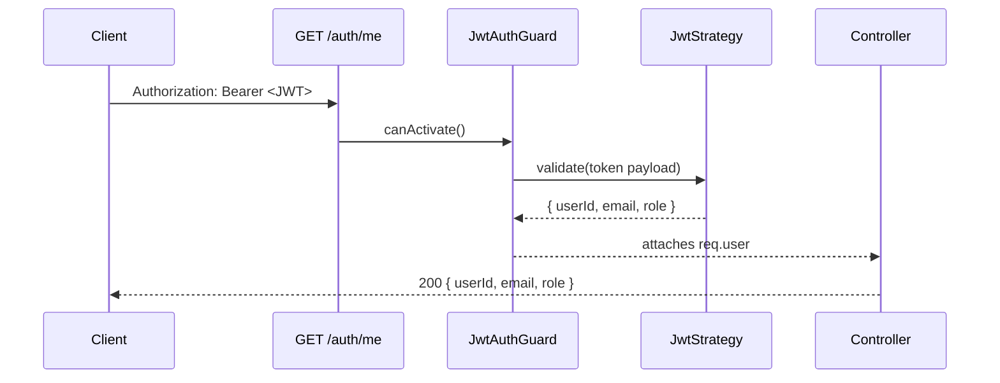
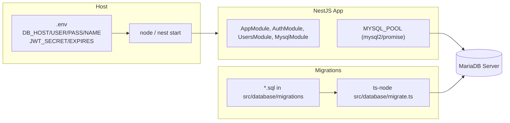

# Student Library API — System Architecture (Steps 1–4, No ORM)

This document visualizes the current backend stack using Mermaid diagrams: high-level components, module wiring, key request lifecycles, RBAC flow, and the minimal data model. It follows NestJS’s modules/controllers/providers/guards architecture and Passport-JWT for auth, with a raw `mysql2/promise` pool for MariaDB access.

> ✅ GitHub supports Mermaid in Markdown, so these diagrams will render automatically in your README.

---

## 1) High-Level Component Architecture

> HTTP request → Controller → Service → Repository (raw SQL) → `mysql2` Pool → MariaDB. Controllers handle routing; providers (services/repos) are DI-injected; guards/strategies handle auth.

---

## 2) Module Dependency Map

> Modules encapsulate providers; exports form the public API between modules.

---

## 3) Login Request Lifecycle (Sequence)

> Passport-JWT strategy & Nest guard pattern for issuing a signed JWT and returning it to the client.

---

## 4) Protected Route + RBAC (Flow)

> Guards gate access: first JWT authentication, then authorization via a roles guard and `@Roles()` decorator.

---

## 5) Minimal Data Model (Current Tables)

> Raw SQL migrations create the `user` table and a `_migrations` ledger. MariaDB is accessed via `mysql2` Promise pool.

---

## 6) `/auth/me` Guard Handshake (Sequence)

> `AuthGuard('jwt')` triggers the JWT strategy, attaches `req.user`, then the controller returns it.

---

## 7) Runtime & Deployment View

> Env-driven config, Nest app processes, SQL migrations runner, and `mysql2` pool to DB.

