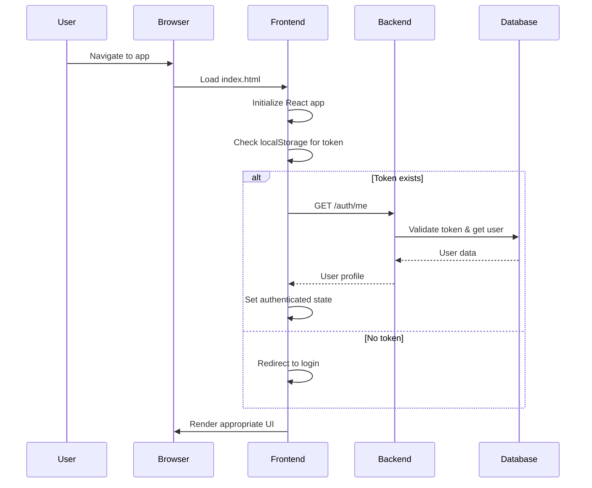
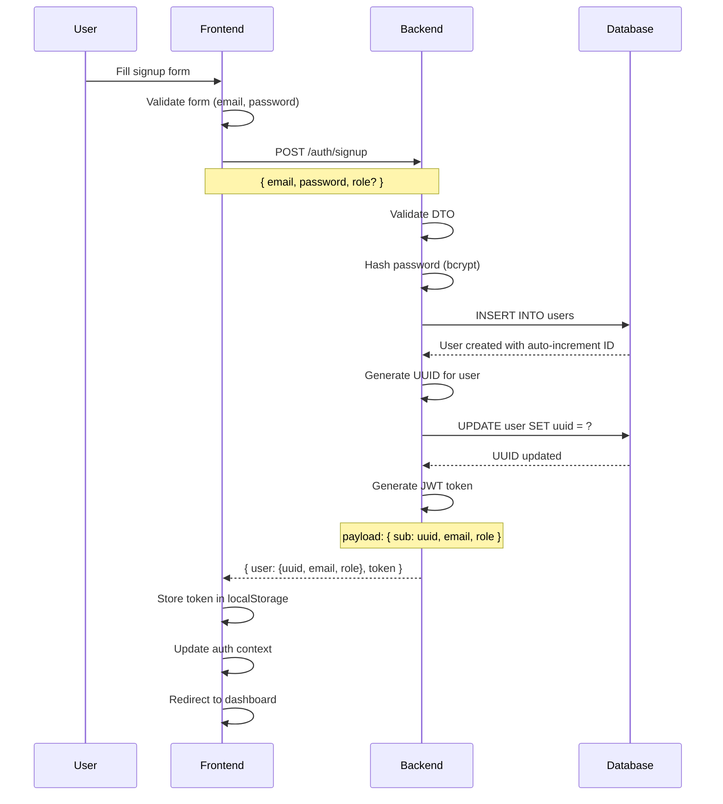
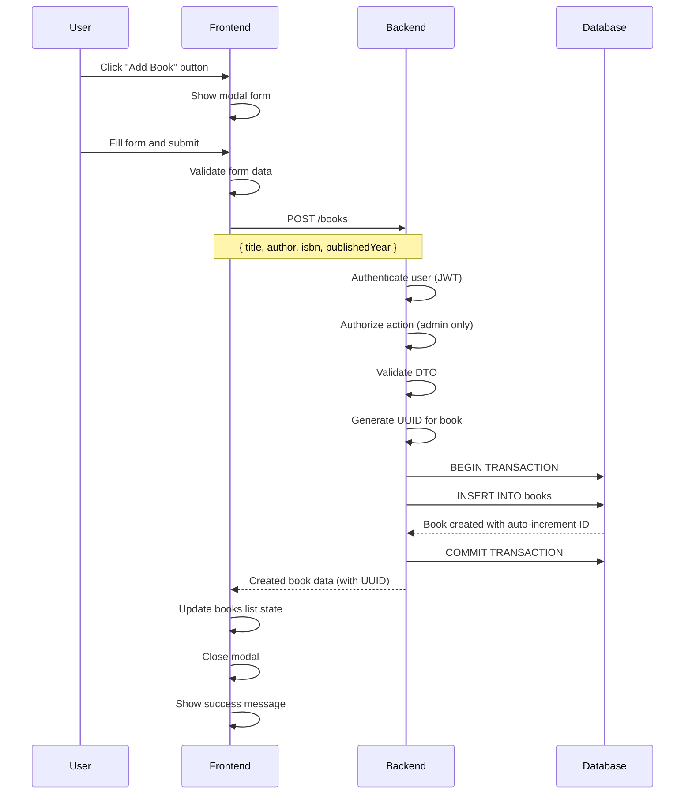
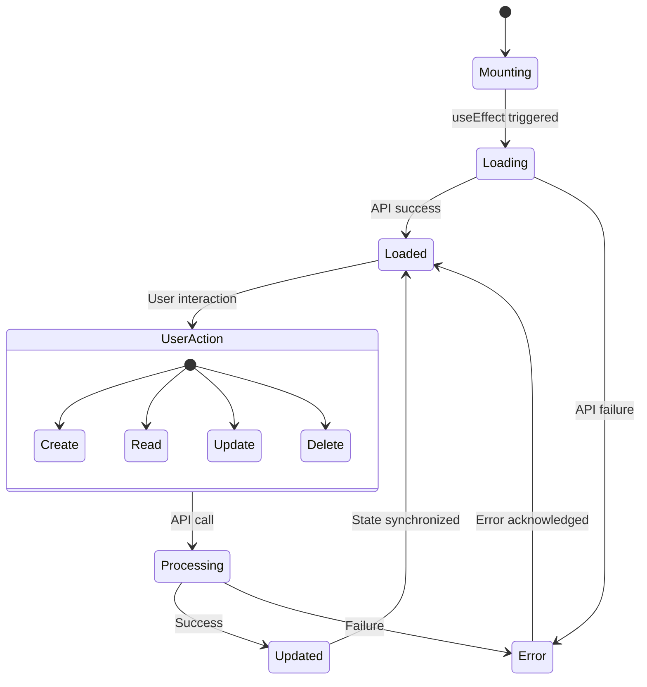

# Full-Stack Library Management System - Deep Dive Architecture Analysis

## 📋 Table of Contents
1. [System Overview](#system-overview)
2. [Frontend-Backend Communication Flow](#frontend-backend-communication-flow)
3. [Authentication & Authorization Flow](#authentication--authorization-flow)
4. [CRUD Operations Deep Dive](#crud-operations-deep-dive)
5. [Data Flow Diagrams](#data-flow-diagrams)
6. [Security Architecture](#security-architecture)
7. [State Management & UI Flow](#state-management--ui-flow)
8. [API Communication Patterns](#api-communication-patterns)
9. [Error Handling & Recovery](#error-handling--recovery)
10. [Performance Considerations](#performance-considerations)

---

## 🏗️ System Overview

### Architecture Pattern
```
┌─────────────────┐    HTTP/REST    ┌─────────────────┐    SQL     ┌─────────────────┐
│                 │ ───────────────▶ │                 │ ──────────▶ │                 │
│   React SPA     │                 │   NestJS API    │            │   MariaDB       │
│   (Frontend)    │ ◀─────────────── │   (Backend)     │ ◀────────── │   (Database)    │
│                 │    JSON/JWT     │                 │   Results   │                 │
└─────────────────┘                 └─────────────────┘             └─────────────────┘
     │                                      │                              │
     │ Vite Dev Server                      │ Docker Container             │ Docker Container
     │ Port: 5173                           │ Port: 3000                   │ Port: 3307
     │                                      │                              │
     ▼                                      ▼                              ▼
┌─────────────────┐                 ┌─────────────────┐             ┌─────────────────┐
│ • React Router  │                 │ • JWT Auth      │             │ • Dual-ID Schema│
│ • HeroUI/Tailwind│                │ • Role Guards   │             │ • TypeORM       │
│ • Zustand/Context│                │ • TypeORM       │             │ • Migration     │
│ • Fetch API     │                 │ • Validation    │             │ • Indexing      │
└─────────────────┘                 └─────────────────┘             └─────────────────┘
```

### Technology Stack Deep Dive

#### Frontend Stack
- **React 18+**: Component-based UI with hooks for state management
- **TypeScript**: Type safety and enhanced developer experience
- **Vite**: Fast build tool with HMR (Hot Module Replacement)
- **HeroUI**: Modern component library built on Tailwind CSS
- **React Router v6**: Client-side routing with nested routes
- **Context API**: Global state management for authentication
- **Fetch API**: HTTP client for backend communication

#### Backend Stack
- **NestJS**: Enterprise-grade Node.js framework with decorators
- **TypeScript**: Shared language with frontend for consistency
- **TypeORM**: Object-Relational Mapping with repository pattern
- **Passport.js**: Authentication middleware with JWT strategy
- **bcrypt**: Password hashing with salt rounds
- **class-validator**: DTO validation with decorators
- **CORS**: Cross-origin resource sharing configuration

#### Database Stack
- **MariaDB**: MySQL-compatible relational database
- **Docker**: Containerized database for development consistency
- **Dual-ID Pattern**: Auto-increment internal IDs + UUID client IDs
- **Migrations**: Version-controlled schema changes

---

## 🌐 Frontend-Backend Communication Flow

### 1. Application Bootstrap Sequence



### 2. API Base Configuration

**Frontend Configuration** (`frontend/src/config/api.ts`):
```typescript
// Environment-based API configuration
const API_BASE = import.meta.env.VITE_API_BASE || 'http://localhost:3000';

// Default headers for all requests
const defaultHeaders = {
  'Content-Type': 'application/json',
  'Accept': 'application/json'
};

// Token injection for authenticated requests
const getAuthHeaders = () => {
  const token = localStorage.getItem('token');
  return token ? { ...defaultHeaders, Authorization: `Bearer ${token}` } : defaultHeaders;
};
```

### 3. Request-Response Cycle Deep Dive

#### Microscopic View of a Single API Call

```typescript
// Frontend: SimpleBooksTable.tsx - fetchBooks function
const fetchBooks = async () => {
  try {
    setLoading(true);
    setError(null);
    
    // 1. Prepare request with authentication
    const response = await fetch(`${API_BASE}/books`, {
      method: 'GET',
      headers: getAuthHeaders(),
      // 2. Browser adds CORS preflight if needed
    });
    
    // 3. Handle HTTP status codes
    if (!response.ok) {
      if (response.status === 401) {
        // Token expired or invalid
        logout(); // Clear local state
        navigate('/login');
        return;
      }
      throw new Error(`HTTP ${response.status}: ${response.statusText}`);
    }
    
    // 4. Parse JSON response
    const data = await response.json();
    
    // 5. Update local state
    setBooks(data);
    
  } catch (error) {
    // 6. Error handling and user feedback
    setError(error.message);
    console.error('Failed to fetch books:', error);
  } finally {
    setLoading(false);
  }
};
```

#### Backend Request Processing Flow

```typescript
// Backend: books.controller.ts - findAll method
@Get()
@UseGuards(JwtAuthGuard) // 1. Authentication guard
async findAll(@Request() req) {
  // 2. Extract user from JWT payload
  const user = req.user;
  
  // 3. Authorization check (implicit - all authenticated users can read)
  
  // 4. Delegate to service layer
  const books = await this.booksService.findAll();
  
  // 5. Transform data (hide internal IDs, expose UUIDs)
  return books.map(book => ({
    id: book.uuid,        // Client sees UUID
    title: book.title,
    author: book.author,
    isbn: book.isbn,
    publishedYear: book.publishedYear,
    createdAt: book.createdAt,
    updatedAt: book.updatedAt
  }));
}
```

#### Database Query Execution

```typescript
// Backend: books.service.ts - findAll method
async findAll(): Promise<Book[]> {
  // 1. TypeORM repository query
  const books = await this.booksRepository.find({
    order: { createdAt: 'DESC' },
    // 2. Eager loading relationships if needed
    // relations: ['author', 'category']
  });
  
  // 3. Return raw entities (internal IDs preserved)
  return books;
}
```

---

## 🔐 Authentication & Authorization Flow

### 1. User Registration Process



### 2. Login Authentication Flow

```typescript
// Frontend: Login.tsx - handleSubmit
const handleSubmit = async (e: React.FormEvent) => {
  e.preventDefault();
  
  try {
    setLoading(true);
    setError('');
    
    // 1. Prepare login payload
    const payload = { email, password };
    
    // 2. Send authentication request
    const response = await fetch(`${API_BASE}/auth/login`, {
      method: 'POST',
      headers: { 'Content-Type': 'application/json' },
      body: JSON.stringify(payload),
    });
    
    if (!response.ok) {
      const errorData = await response.json();
      throw new Error(errorData.message || 'Login failed');
    }
    
    // 3. Process successful authentication
    const data = await response.json();
    
    // 4. Store authentication state
    localStorage.setItem('token', data.token);
    
    // 5. Update global auth context
    login(data.user, data.token);
    
    // 6. Navigate based on user role
    navigate(data.user.role === 'admin' ? '/admin' : '/dashboard');
    
  } catch (error) {
    setError(error.message);
  } finally {
    setLoading(false);
  }
};
```

### 3. JWT Token Validation Process

```typescript
// Backend: jwt.strategy.ts - validate method
async validate(payload: JwtPayload): Promise<any> {
  // 1. Extract user identifier from token
  const { sub: uuid, email, role } = payload;
  
  // 2. Verify user still exists and is active
  const user = await this.usersService.findByUuid(uuid);
  if (!user) {
    throw new UnauthorizedException('User not found');
  }
  
  // 3. Return user object for request context
  return {
    id: user.id,           // Internal ID for backend use
    uuid: user.uuid,       // Client ID
    email: user.email,
    role: user.role,
  };
}
```

### 4. Role-Based Access Control (RBAC)

```typescript
// Backend: roles.guard.ts - canActivate method
@Injectable()
export class RolesGuard implements CanActivate {
  constructor(private reflector: Reflector) {}

  canActivate(context: ExecutionContext): boolean {
    // 1. Get required roles from decorator
    const requiredRoles = this.reflector.getAllAndOverride<Role[]>(ROLES_KEY, [
      context.getHandler(),
      context.getClass(),
    ]);
    
    if (!requiredRoles) {
      return true; // No roles required
    }
    
    // 2. Extract user from request
    const { user } = context.switchToHttp().getRequest();
    
    // 3. Check if user has required role
    return requiredRoles.some((role) => user.role === role);
  }
}

// Usage in controller
@Delete(':id')
@UseGuards(JwtAuthGuard, RolesGuard)
@Roles('admin')
async remove(@Param('id') id: string, @Request() req) {
  // Only admins can delete books
  return this.booksService.remove(id, req.user);
}
```

---

## 📊 CRUD Operations Deep Dive

### 1. Create Operation Flow (POST)



#### Frontend Create Implementation

```typescript
// Frontend: SimpleBooksTable.tsx - handleCreate
const handleCreate = async () => {
  try {
    setLoading(true);
    
    // 1. Prepare book data
    const bookData = {
      title: newBook.title.trim(),
      author: newBook.author.trim(),
      isbn: newBook.isbn.trim(),
      publishedYear: parseInt(newBook.publishedYear) || null,
    };
    
    // 2. Send create request
    const response = await fetch(`${API_BASE}/books`, {
      method: 'POST',
      headers: getAuthHeaders(),
      body: JSON.stringify(bookData),
    });
    
    if (!response.ok) {
      const errorData = await response.json();
      throw new Error(errorData.message || 'Failed to create book');
    }
    
    // 3. Process successful creation
    const createdBook = await response.json();
    
    // 4. Update local state optimistically
    setBooks(prevBooks => [createdBook, ...prevBooks]);
    
    // 5. Reset form and close modal
    setNewBook({ title: '', author: '', isbn: '', publishedYear: '' });
    setShowAddModal(false);
    
    // 6. Show success feedback
    setMessage({ type: 'success', text: 'Book created successfully!' });
    
  } catch (error) {
    setMessage({ type: 'error', text: error.message });
  } finally {
    setLoading(false);
  }
};
```

#### Backend Create Implementation

```typescript
// Backend: books.controller.ts - create method
@Post()
@UseGuards(JwtAuthGuard, RolesGuard)
@Roles('admin')
async create(@Body() createBookDto: CreateBookDto, @Request() req) {
  // 1. User already authenticated and authorized by guards
  const user = req.user;
  
  // 2. Delegate to service layer
  const book = await this.booksService.create(createBookDto, user);
  
  // 3. Transform response (hide internal ID)
  return {
    id: book.uuid,
    title: book.title,
    author: book.author,
    isbn: book.isbn,
    publishedYear: book.publishedYear,
    createdAt: book.createdAt,
    updatedAt: book.updatedAt,
  };
}

// Backend: books.service.ts - create method
async create(createBookDto: CreateBookDto, user: any): Promise<Book> {
  // 1. Create book entity
  const book = this.booksRepository.create({
    ...createBookDto,
    uuid: uuidv4(), // Generate client-facing ID
    // createdBy: user.id, // If tracking who created the book
  });
  
  // 2. Save to database
  const savedBook = await this.booksRepository.save(book);
  
  // 3. Return complete entity
  return savedBook;
}
```

### 2. Read Operation Flow (GET)

#### List All Books

```typescript
// Frontend: useEffect for initial data loading
useEffect(() => {
  const loadBooks = async () => {
    try {
      setLoading(true);
      
      // 1. Fetch all books
      const response = await fetch(`${API_BASE}/books`, {
        headers: getAuthHeaders(),
      });
      
      if (!response.ok) {
        throw new Error('Failed to load books');
      }
      
      // 2. Update state with fetched data
      const booksData = await response.json();
      setBooks(booksData);
      
    } catch (error) {
      setError(error.message);
    } finally {
      setLoading(false);
    }
  };
  
  // 3. Load data on component mount
  loadBooks();
}, [token]); // Re-load if authentication changes
```

#### Get Single Book by UUID

```typescript
// Backend: books.controller.ts - findOne method
@Get(':id')
@UseGuards(JwtAuthGuard)
async findOne(@Param('id') uuid: string) {
  // 1. Find book by UUID (not internal ID)
  const book = await this.booksService.findByUuid(uuid);
  
  if (!book) {
    throw new NotFoundException('Book not found');
  }
  
  // 2. Return public data
  return {
    id: book.uuid,
    title: book.title,
    author: book.author,
    isbn: book.isbn,
    publishedYear: book.publishedYear,
    createdAt: book.createdAt,
    updatedAt: book.updatedAt,
  };
}
```

### 3. Update Operation Flow (PATCH)

```typescript
// Frontend: SimpleBooksTable.tsx - handleUpdate
const handleUpdate = async () => {
  try {
    setLoading(true);
    
    // 1. Prepare update data
    const updateData = {
      title: editBook.title.trim(),
      author: editBook.author.trim(),
      isbn: editBook.isbn.trim(),
      publishedYear: parseInt(editBook.publishedYear) || null,
    };
    
    // 2. Send update request
    const response = await fetch(`${API_BASE}/books/${editBook.id}`, {
      method: 'PATCH',
      headers: getAuthHeaders(),
      body: JSON.stringify(updateData),
    });
    
    if (!response.ok) {
      const errorData = await response.json();
      throw new Error(errorData.message || 'Failed to update book');
    }
    
    // 3. Process successful update
    const updatedBook = await response.json();
    
    // 4. Update local state
    setBooks(prevBooks =>
      prevBooks.map(book =>
        book.id === editBook.id ? updatedBook : book
      )
    );
    
    // 5. Close modal and reset form
    setShowEditModal(false);
    setEditBook(null);
    
    setMessage({ type: 'success', text: 'Book updated successfully!' });
    
  } catch (error) {
    setMessage({ type: 'error', text: error.message });
  } finally {
    setLoading(false);
  }
};
```

### 4. Delete Operation Flow (DELETE)

```typescript
// Frontend: SimpleBooksTable.tsx - handleDelete
const handleDelete = async () => {
  try {
    setLoading(true);
    
    // 1. Send delete request
    const response = await fetch(`${API_BASE}/books/${selectedBook.id}`, {
      method: 'DELETE',
      headers: getAuthHeaders(),
    });
    
    if (!response.ok) {
      const errorData = await response.json();
      throw new Error(errorData.message || 'Failed to delete book');
    }
    
    // 2. Update local state optimistically
    setBooks(prevBooks =>
      prevBooks.filter(book => book.id !== selectedBook.id)
    );
    
    // 3. Close modal and reset selection
    setShowDeleteModal(false);
    setSelectedBook(null);
    
    setMessage({ type: 'success', text: 'Book deleted successfully!' });
    
  } catch (error) {
    setMessage({ type: 'error', text: error.message });
  } finally {
    setLoading(false);
  }
};
```

---

## 🔄 Data Flow Diagrams

### 1. Complete Application Data Flow

```
┌─────────────────────────────────────────────────────────────────────────────────┐
│                                Frontend (React SPA)                            │
├─────────────────────────────────────────────────────────────────────────────────┤
│                                                                                 │
│  ┌─────────────┐    ┌─────────────┐    ┌─────────────┐    ┌─────────────┐      │
│  │   Login     │    │  Dashboard  │    │ Books Table │    │ Users Table │      │
│  │ Component   │    │ Component   │    │ Component   │    │ Component   │      │
│  └─────────────┘    └─────────────┘    └─────────────┘    └─────────────┘      │
│         │                    │                   │                   │         │
│         └────────────────────┼───────────────────┼───────────────────┘         │
│                              │                   │                             │
│                    ┌─────────────────────────────────────────┐                 │
│                    │        Auth Context Provider            │                 │
│                    │  • User state                          │                 │
│                    │  • Token management                    │                 │
│                    │  • Login/logout functions             │                 │
│                    └─────────────────────────────────────────┘                 │
│                              │                                                 │
└──────────────────────────────┼─────────────────────────────────────────────────┘
                               │ HTTP Requests (Fetch API)
                               │ Headers: Authorization: Bearer <token>
                               │
┌──────────────────────────────▼─────────────────────────────────────────────────┐
│                              Backend (NestJS API)                              │
├─────────────────────────────────────────────────────────────────────────────────┤
│                                                                                 │
│  ┌─────────────┐    ┌─────────────┐    ┌─────────────┐    ┌─────────────┐      │
│  │    Auth     │    │    Books    │    │    Users    │    │   Health    │      │
│  │ Controller  │    │ Controller  │    │ Controller  │    │ Controller  │      │
│  └─────────────┘    └─────────────┘    └─────────────┘    └─────────────┘      │
│         │                    │                   │                   │         │
│         │                    │                   │                   │         │
│  ┌─────────────┐    ┌─────────────┐    ┌─────────────┐                        │
│  │    Auth     │    │    Books    │    │    Users    │                        │
│  │   Service   │    │   Service   │    │   Service   │                        │
│  └─────────────┘    └─────────────┘    └─────────────┘                        │
│         │                    │                   │                             │
│         │                    │                   │                             │
│         └────────────────────┼───────────────────┘                             │
│                              │                                                 │
│                    ┌─────────────────────────────────────────┐                 │
│                    │           TypeORM Repository            │                 │
│                    │  • User Repository                      │                 │
│                    │  • Book Repository                      │                 │
│                    │  • Query Builder                       │                 │
│                    └─────────────────────────────────────────┘                 │
│                              │                                                 │
└──────────────────────────────┼─────────────────────────────────────────────────┘
                               │ SQL Queries
                               │ Connection Pool
                               │
┌──────────────────────────────▼─────────────────────────────────────────────────┐
│                           Database (MariaDB)                                   │
├─────────────────────────────────────────────────────────────────────────────────┤
│                                                                                 │
│  ┌─────────────────┐                    ┌─────────────────┐                    │
│  │     users       │                    │     books       │                    │
│  ├─────────────────┤                    ├─────────────────┤                    │
│  │ id (AUTO_INC)   │                    │ id (AUTO_INC)   │                    │
│  │ uuid (CHAR 36)  │                    │ uuid (CHAR 36)  │                    │
│  │ email (VARCHAR) │                    │ title (VARCHAR) │                    │
│  │ password (HASH) │                    │ author (VARCHAR)│                    │
│  │ role (ENUM)     │                    │ isbn (VARCHAR)  │                    │
│  │ created_at      │                    │ published_year  │                    │
│  │ updated_at      │                    │ created_at      │                    │
│  └─────────────────┘                    │ updated_at      │                    │
│                                         └─────────────────┘                    │
│                                                                                 │
└─────────────────────────────────────────────────────────────────────────────────┘
```

### 2. Authentication State Flow

```
┌─────────────┐    ┌─────────────┐    ┌─────────────┐    ┌─────────────┐
│   Visitor   │───▶│  Login Form │───▶│ Auth Check  │───▶│ Authorized  │
│             │    │             │    │             │    │    User     │
└─────────────┘    └─────────────┘    └─────────────┘    └─────────────┘
                           │                   │                   │
                           │                   │                   │
                           ▼                   ▼                   ▼
                   ┌─────────────┐    ┌─────────────┐    ┌─────────────┐
                   │ POST /auth/ │    │ JWT Token   │    │ Dashboard/  │
                   │ login       │    │ Validation  │    │ Admin Panel │
                   └─────────────┘    └─────────────┘    └─────────────┘
```

### 3. CRUD Operation State Transitions

```
Books List State Machine:
┌─────────────┐
│   LOADING   │───┐
└─────────────┘   │
       │          │
       ▼          │
┌─────────────┐   │
│   LOADED    │◀──┘
└─────────────┘
       │
       ▼
┌─────────────┐    ┌─────────────┐    ┌─────────────┐
│   EDITING   │───▶│  UPDATING   │───▶│   UPDATED   │
└─────────────┘    └─────────────┘    └─────────────┘
       │                                      │
       │            ┌─────────────┐           │
       └───────────▶│   ERROR     │◀──────────┘
                    └─────────────┘
```

---

## 🛡️ Security Architecture

### 1. Multi-Layer Security Model

```
┌─────────────────────────────────────────────────────────────────┐
│                        Frontend Security                       │
├─────────────────────────────────────────────────────────────────┤
│ • Input Validation (Form validation)                          │
│ • XSS Prevention (React's built-in escaping)                  │
│ • CSRF Protection (SameSite cookies if used)                  │
│ • Secure Token Storage (localStorage with expiration)         │
│ • Role-based UI Rendering                                     │
└─────────────────────────────────────────────────────────────────┘
                                │
                                ▼
┌─────────────────────────────────────────────────────────────────┐
│                     Transport Security                         │
├─────────────────────────────────────────────────────────────────┤
│ • HTTPS Encryption (TLS 1.2+)                                 │
│ • CORS Configuration                                          │
│ • Request/Response Encryption                                 │
│ • Header Security (Helmet.js)                                │
└─────────────────────────────────────────────────────────────────┘
                                │
                                ▼
┌─────────────────────────────────────────────────────────────────┐
│                        Backend Security                        │
├─────────────────────────────────────────────────────────────────┤
│ • JWT Authentication                                          │
│ • Role-based Authorization                                    │
│ • Input Validation (class-validator)                         │
│ • Rate Limiting (if configured)                              │
│ • SQL Injection Prevention (TypeORM parameterized queries)    │
└─────────────────────────────────────────────────────────────────┘
                                │
                                ▼
┌─────────────────────────────────────────────────────────────────┐
│                       Database Security                        │
├─────────────────────────────────────────────────────────────────┤
│ • Dual-ID Pattern (Hide internal structure)                   │
│ • Password Hashing (bcrypt with salt)                        │
│ • Connection Encryption                                       │
│ • User Permissions (Database level)                          │
│ • Data Validation (Schema constraints)                       │
└─────────────────────────────────────────────────────────────────┘
```

### 2. JWT Token Security Implementation

```typescript
// Backend: JWT Token Generation
const generateToken = (user: User): string => {
  const payload: JwtPayload = {
    sub: user.uuid,        // Subject: user UUID (not internal ID)
    email: user.email,
    role: user.role,
    iat: Math.floor(Date.now() / 1000),           // Issued at
    exp: Math.floor(Date.now() / 1000) + 86400,   // Expires in 24 hours
  };
  
  return this.jwtService.sign(payload, {
    secret: process.env.JWT_SECRET,
    algorithm: 'HS256',
  });
};

// Frontend: Token Management
class TokenManager {
  private static readonly TOKEN_KEY = 'auth_token';
  private static readonly EXPIRY_KEY = 'token_expiry';
  
  static setToken(token: string, expiryHours: number = 24): void {
    const expiry = Date.now() + (expiryHours * 60 * 60 * 1000);
    localStorage.setItem(this.TOKEN_KEY, token);
    localStorage.setItem(this.EXPIRY_KEY, expiry.toString());
  }
  
  static getToken(): string | null {
    const token = localStorage.getItem(this.TOKEN_KEY);
    const expiry = localStorage.getItem(this.EXPIRY_KEY);
    
    if (!token || !expiry) return null;
    
    if (Date.now() > parseInt(expiry)) {
      this.clearToken();
      return null;
    }
    
    return token;
  }
  
  static clearToken(): void {
    localStorage.removeItem(this.TOKEN_KEY);
    localStorage.removeItem(this.EXPIRY_KEY);
  }
}
```

### 3. Dual-ID Security Pattern

```sql
-- Database Schema with Dual-ID Pattern
CREATE TABLE users (
  id INT AUTO_INCREMENT PRIMARY KEY,    -- Internal use only
  uuid CHAR(36) UNIQUE NOT NULL,        -- Client-facing ID
  email VARCHAR(255) UNIQUE NOT NULL,
  password VARCHAR(255) NOT NULL,       -- bcrypt hashed
  role ENUM('student', 'admin') DEFAULT 'student',
  created_at TIMESTAMP DEFAULT CURRENT_TIMESTAMP,
  updated_at TIMESTAMP DEFAULT CURRENT_TIMESTAMP ON UPDATE CURRENT_TIMESTAMP,
  
  INDEX idx_uuid (uuid),                -- Fast UUID lookups
  INDEX idx_email (email)               -- Fast email lookups
);
```

**Security Benefits:**
1. **Information Disclosure Prevention**: Internal auto-increment IDs never exposed
2. **Enumeration Attack Prevention**: UUIDs are non-sequential and unpredictable
3. **Database Optimization**: Internal IDs for fast joins and indexing
4. **Client Simplicity**: UUIDs for all client-side operations

---

## 🎯 State Management & UI Flow

### 1. Frontend State Architecture

```typescript
// Global Authentication State (Context API)
interface AuthContextType {
  user: User | null;
  token: string | null;
  isLoading: boolean;
  login: (user: User, token: string) => void;
  logout: () => void;
  updateUser: (user: Partial<User>) => void;
}

// Local Component State Management
interface BooksTableState {
  books: Book[];
  loading: boolean;
  error: string | null;
  
  // Modal states
  showAddModal: boolean;
  showEditModal: boolean;
  showViewModal: boolean;
  showDeleteModal: boolean;
  
  // Form states
  newBook: CreateBookDto;
  editBook: Book | null;
  selectedBook: Book | null;
  
  // UI feedback
  message: { type: 'success' | 'error'; text: string } | null;
}
```

### 2. Component Lifecycle & State Updates



### 3. Real-time State Synchronization

```typescript
// Optimistic Updates Pattern
const handleOptimisticUpdate = async (bookId: string, updates: Partial<Book>) => {
  // 1. Immediately update UI
  setBooks(prevBooks => 
    prevBooks.map(book => 
      book.id === bookId ? { ...book, ...updates } : book
    )
  );
  
  try {
    // 2. Send request to backend
    const response = await fetch(`${API_BASE}/books/${bookId}`, {
      method: 'PATCH',
      headers: getAuthHeaders(),
      body: JSON.stringify(updates),
    });
    
    if (!response.ok) {
      throw new Error('Update failed');
    }
    
    // 3. Confirm with server response
    const updatedBook = await response.json();
    setBooks(prevBooks => 
      prevBooks.map(book => 
        book.id === bookId ? updatedBook : book
      )
    );
    
  } catch (error) {
    // 4. Revert optimistic update on failure
    setBooks(prevBooks => 
      prevBooks.map(book => 
        book.id === bookId ? { ...book, ...originalData } : book
      )
    );
    setError('Failed to update book');
  }
};
```

---

## 🚀 API Communication Patterns

### 1. Request/Response Patterns

#### RESTful API Design
```
Resource: Books
├── GET    /books          → List all books
├── GET    /books/:uuid    → Get single book
├── POST   /books          → Create new book
├── PATCH  /books/:uuid    → Update existing book
└── DELETE /books/:uuid    → Delete book

Resource: Users
├── GET    /users          → List all users (admin only)
├── GET    /users/:uuid    → Get single user
├── POST   /users          → Create new user (admin only)
├── PATCH  /users/:uuid    → Update existing user (admin only)
└── DELETE /users/:uuid    → Delete user (admin only)

Authentication
├── POST   /auth/login     → User login
├── POST   /auth/signup    → User registration
└── GET    /auth/me        → Get current user profile
```

#### Response Format Standardization
```typescript
// Success Response Format
interface ApiResponse<T> {
  data: T;
  message?: string;
  timestamp: string;
}

// Error Response Format
interface ApiError {
  error: {
    message: string;
    code: string;
    details?: any;
  };
  timestamp: string;
  path: string;
}

// Implementation in NestJS
@Controller('books')
export class BooksController {
  @Get()
  async findAll(): Promise<Book[]> {
    return this.booksService.findAll();
  }
  
  @Post()
  async create(@Body() createBookDto: CreateBookDto): Promise<Book> {
    return this.booksService.create(createBookDto);
  }
}
```

### 2. Error Handling Patterns

```typescript
// Frontend: Centralized Error Handling
class ApiClient {
  private static async handleResponse<T>(response: Response): Promise<T> {
    if (!response.ok) {
      const errorData = await response.json().catch(() => ({}));
      
      switch (response.status) {
        case 401:
          // Unauthorized - redirect to login
          AuthService.logout();
          window.location.href = '/login';
          throw new Error('Session expired');
          
        case 403:
          // Forbidden - insufficient permissions
          throw new Error('Access denied');
          
        case 404:
          // Not found
          throw new Error('Resource not found');
          
        case 422:
          // Validation error
          throw new Error(errorData.message || 'Validation failed');
          
        default:
          throw new Error(errorData.message || 'An error occurred');
      }
    }
    
    return response.json();
  }
  
  static async get<T>(url: string): Promise<T> {
    const response = await fetch(url, {
      headers: this.getAuthHeaders(),
    });
    return this.handleResponse<T>(response);
  }
  
  static async post<T>(url: string, data: any): Promise<T> {
    const response = await fetch(url, {
      method: 'POST',
      headers: this.getAuthHeaders(),
      body: JSON.stringify(data),
    });
    return this.handleResponse<T>(response);
  }
}
```

### 3. Caching and Performance Optimization

```typescript
// Simple In-Memory Cache for Frequently Accessed Data
class CacheManager {
  private static cache = new Map<string, { data: any; expiry: number }>();
  
  static set<T>(key: string, data: T, ttlMinutes: number = 5): void {
    const expiry = Date.now() + (ttlMinutes * 60 * 1000);
    this.cache.set(key, { data, expiry });
  }
  
  static get<T>(key: string): T | null {
    const item = this.cache.get(key);
    if (!item) return null;
    
    if (Date.now() > item.expiry) {
      this.cache.delete(key);
      return null;
    }
    
    return item.data;
  }
  
  static clear(): void {
    this.cache.clear();
  }
}

// Usage in API calls
const fetchBooksWithCache = async (): Promise<Book[]> => {
  const cacheKey = 'books_list';
  const cached = CacheManager.get<Book[]>(cacheKey);
  
  if (cached) {
    return cached;
  }
  
  const books = await ApiClient.get<Book[]>('/books');
  CacheManager.set(cacheKey, books, 2); // Cache for 2 minutes
  
  return books;
};
```

---

## 🔧 Error Handling & Recovery

### 1. Progressive Error Handling Strategy

```typescript
// Frontend: Error Boundary Component
class ErrorBoundary extends React.Component<
  { children: React.ReactNode },
  { hasError: boolean; error: Error | null }
> {
  constructor(props: any) {
    super(props);
    this.state = { hasError: false, error: null };
  }
  
  static getDerivedStateFromError(error: Error) {
    return { hasError: true, error };
  }
  
  componentDidCatch(error: Error, errorInfo: React.ErrorInfo) {
    console.error('Error caught by boundary:', error, errorInfo);
    
    // Log error to monitoring service
    // this.logErrorToService(error, errorInfo);
  }
  
  render() {
    if (this.state.hasError) {
      return (
        <div className="error-fallback">
          <h2>Something went wrong</h2>
          <p>{this.state.error?.message}</p>
          <button onClick={() => window.location.reload()}>
            Reload Page
          </button>
        </div>
      );
    }
    
    return this.props.children;
  }
}
```

### 2. Network Error Recovery

```typescript
// Retry Logic with Exponential Backoff
class RetryableApiClient {
  private static async retryWithBackoff<T>(
    operation: () => Promise<T>,
    maxRetries: number = 3,
    baseDelay: number = 1000
  ): Promise<T> {
    let lastError: Error;
    
    for (let attempt = 0; attempt <= maxRetries; attempt++) {
      try {
        return await operation();
      } catch (error) {
        lastError = error as Error;
        
        if (attempt === maxRetries) {
          throw lastError;
        }
        
        // Exponential backoff: 1s, 2s, 4s, 8s...
        const delay = baseDelay * Math.pow(2, attempt);
        await new Promise(resolve => setTimeout(resolve, delay));
      }
    }
    
    throw lastError!;
  }
  
  static async fetchWithRetry<T>(url: string, options?: RequestInit): Promise<T> {
    return this.retryWithBackoff(async () => {
      const response = await fetch(url, options);
      
      if (!response.ok) {
        throw new Error(`HTTP ${response.status}: ${response.statusText}`);
      }
      
      return response.json();
    });
  }
}
```

### 3. Graceful Degradation

```typescript
// Offline Detection and Fallback
const useOfflineDetection = () => {
  const [isOnline, setIsOnline] = useState(navigator.onLine);
  
  useEffect(() => {
    const handleOnline = () => setIsOnline(true);
    const handleOffline = () => setIsOnline(false);
    
    window.addEventListener('online', handleOnline);
    window.addEventListener('offline', handleOffline);
    
    return () => {
      window.removeEventListener('online', handleOnline);
      window.removeEventListener('offline', handleOffline);
    };
  }, []);
  
  return isOnline;
};

// Component with Offline Handling
const BooksTable: React.FC = () => {
  const isOnline = useOfflineDetection();
  const [books, setBooks] = useState<Book[]>([]);
  const [offlineQueue, setOfflineQueue] = useState<PendingAction[]>([]);
  
  useEffect(() => {
    if (isOnline && offlineQueue.length > 0) {
      // Process queued actions when back online
      offlineQueue.forEach(action => {
        processAction(action);
      });
      setOfflineQueue([]);
    }
  }, [isOnline, offlineQueue]);
  
  const handleCreateBook = async (bookData: CreateBookDto) => {
    if (!isOnline) {
      // Queue action for later
      setOfflineQueue(prev => [...prev, { type: 'CREATE', data: bookData }]);
      setMessage({ type: 'info', text: 'Action queued - will sync when online' });
      return;
    }
    
    // Normal online processing
    try {
      const newBook = await ApiClient.post<Book>('/books', bookData);
      setBooks(prev => [newBook, ...prev]);
    } catch (error) {
      setMessage({ type: 'error', text: error.message });
    }
  };
  
  return (
    <div>
      {!isOnline && (
        <div className="offline-banner">
          ⚠️ You're offline. Actions will be synced when connection is restored.
        </div>
      )}
      {/* Rest of component */}
    </div>
  );
};
```

---

## ⚡ Performance Considerations

### 1. Frontend Performance Optimization

```typescript
// React Performance Optimizations

// 1. Memoization for Expensive Calculations
const BooksList = React.memo(({ books, userRole }: BooksListProps) => {
  const filteredBooks = useMemo(() => {
    return books.filter(book => 
      userRole === 'admin' || book.isPublished
    );
  }, [books, userRole]);
  
  return (
    <div>
      {filteredBooks.map(book => (
        <BookItem key={book.id} book={book} />
      ))}
    </div>
  );
});

// 2. Debounced Search
const useDebounce = (value: string, delay: number) => {
  const [debouncedValue, setDebouncedValue] = useState(value);
  
  useEffect(() => {
    const handler = setTimeout(() => {
      setDebouncedValue(value);
    }, delay);
    
    return () => {
      clearTimeout(handler);
    };
  }, [value, delay]);
  
  return debouncedValue;
};

const SearchableBooksList = () => {
  const [searchTerm, setSearchTerm] = useState('');
  const debouncedSearchTerm = useDebounce(searchTerm, 300);
  
  useEffect(() => {
    if (debouncedSearchTerm) {
      searchBooks(debouncedSearchTerm);
    }
  }, [debouncedSearchTerm]);
  
  return (
    <input
      type="text"
      value={searchTerm}
      onChange={(e) => setSearchTerm(e.target.value)}
      placeholder="Search books..."
    />
  );
};

// 3. Virtual Scrolling for Large Lists
const VirtualizedBooksList = ({ books }: { books: Book[] }) => {
  const listRef = useRef<HTMLDivElement>(null);
  const [visibleRange, setVisibleRange] = useState({ start: 0, end: 50 });
  
  useEffect(() => {
    const handleScroll = () => {
      if (!listRef.current) return;
      
      const { scrollTop, clientHeight } = listRef.current;
      const itemHeight = 60; // Approximate item height
      
      const start = Math.floor(scrollTop / itemHeight);
      const end = Math.min(start + Math.ceil(clientHeight / itemHeight) + 10, books.length);
      
      setVisibleRange({ start, end });
    };
    
    const list = listRef.current;
    list?.addEventListener('scroll', handleScroll);
    
    return () => list?.removeEventListener('scroll', handleScroll);
  }, [books.length]);
  
  const visibleBooks = books.slice(visibleRange.start, visibleRange.end);
  
  return (
    <div ref={listRef} style={{ height: '500px', overflow: 'auto' }}>
      <div style={{ height: visibleRange.start * 60 }} />
      {visibleBooks.map(book => (
        <BookItem key={book.id} book={book} />
      ))}
      <div style={{ height: (books.length - visibleRange.end) * 60 }} />
    </div>
  );
};
```

### 2. Backend Performance Optimization

```typescript
// Database Query Optimization

// 1. Efficient Pagination
@Get()
async findAll(
  @Query('page', new DefaultValuePipe(1), ParseIntPipe) page: number,
  @Query('limit', new DefaultValuePipe(10), ParseIntPipe) limit: number,
  @Query('search') search?: string,
) {
  const offset = (page - 1) * limit;
  
  const queryBuilder = this.booksRepository
    .createQueryBuilder('book')
    .orderBy('book.createdAt', 'DESC')
    .offset(offset)
    .limit(limit);
  
  if (search) {
    queryBuilder.where(
      'book.title ILIKE :search OR book.author ILIKE :search',
      { search: `%${search}%` }
    );
  }
  
  const [books, total] = await queryBuilder.getManyAndCount();
  
  return {
    books: books.map(book => this.transformBook(book)),
    pagination: {
      page,
      limit,
      total,
      pages: Math.ceil(total / limit),
    },
  };
}

// 2. Connection Pooling Configuration
@Module({
  imports: [
    TypeOrmModule.forRoot({
      type: 'mariadb',
      host: process.env.DB_HOST,
      port: parseInt(process.env.DB_PORT, 10),
      username: process.env.DB_USERNAME,
      password: process.env.DB_PASSWORD,
      database: process.env.DB_DATABASE,
      
      // Connection Pool Settings
      extra: {
        connectionLimit: 10,        // Maximum number of connections
        acquireTimeout: 60000,      // Maximum time to get connection
        timeout: 60000,             // Maximum time for query
        reconnect: true,            // Reconnect on connection loss
      },
      
      // Performance Settings
      logging: process.env.NODE_ENV === 'development',
      cache: {
        duration: 30000, // Cache for 30 seconds
      },
    }),
  ],
})
export class DatabaseModule {}

// 3. Response Caching
@Injectable()
export class CacheInterceptor implements NestInterceptor {
  private cache = new Map<string, { data: any; expiry: number }>();
  
  intercept(context: ExecutionContext, next: CallHandler): Observable<any> {
    const request = context.switchToHttp().getRequest();
    const cacheKey = `${request.method}:${request.url}`;
    
    // Check cache for GET requests
    if (request.method === 'GET') {
      const cached = this.cache.get(cacheKey);
      if (cached && Date.now() < cached.expiry) {
        return of(cached.data);
      }
    }
    
    return next.handle().pipe(
      tap(response => {
        // Cache successful GET responses
        if (request.method === 'GET' && response) {
          const expiry = Date.now() + (5 * 60 * 1000); // 5 minutes
          this.cache.set(cacheKey, { data: response, expiry });
        }
      })
    );
  }
}
```

### 3. Database Performance Optimization

```sql
-- Index Optimization for Common Queries

-- Users table indexes
CREATE INDEX idx_users_uuid ON users(uuid);
CREATE INDEX idx_users_email ON users(email);
CREATE INDEX idx_users_role ON users(role);
CREATE INDEX idx_users_created_at ON users(created_at);

-- Books table indexes
CREATE INDEX idx_books_uuid ON books(uuid);
CREATE INDEX idx_books_title ON books(title);
CREATE INDEX idx_books_author ON books(author);
CREATE INDEX idx_books_isbn ON books(isbn);
CREATE INDEX idx_books_created_at ON books(created_at);

-- Composite indexes for common queries
CREATE INDEX idx_books_search ON books(title, author);
CREATE INDEX idx_users_auth ON users(email, password);

-- Query Performance Analysis
EXPLAIN SELECT * FROM books 
WHERE title LIKE '%search%' OR author LIKE '%search%'
ORDER BY created_at DESC 
LIMIT 10 OFFSET 0;
```

---

## 🎯 Conclusion

This deep-dive analysis covers the complete architecture of our full-stack library management system, from the microscopic level of individual API calls to the macroscopic view of system-wide data flow. The dual-ID security pattern, comprehensive authentication system, and well-structured CRUD operations provide a robust foundation for a production-ready application.

### Key Architectural Strengths:
1. **Security-First Design**: Dual-ID pattern prevents information disclosure
2. **Type Safety**: End-to-end TypeScript for better maintainability
3. **Scalable Architecture**: Modular design with clear separation of concerns
4. **Performance Optimization**: Caching, virtualization, and database optimization
5. **Error Resilience**: Comprehensive error handling and recovery mechanisms
6. **User Experience**: Real-time feedback and optimistic updates

### Production Readiness Checklist:
- ✅ Authentication & Authorization
- ✅ Data Validation & Sanitization
- ✅ Error Handling & Logging
- ✅ Security Best Practices
- ✅ Performance Optimization
- ✅ Responsive UI Design
- ✅ Database Migration System
- ✅ Docker Containerization
- ✅ Environment Configuration

The system is ready for deployment and can handle real-world usage with proper monitoring and maintenance procedures in place.